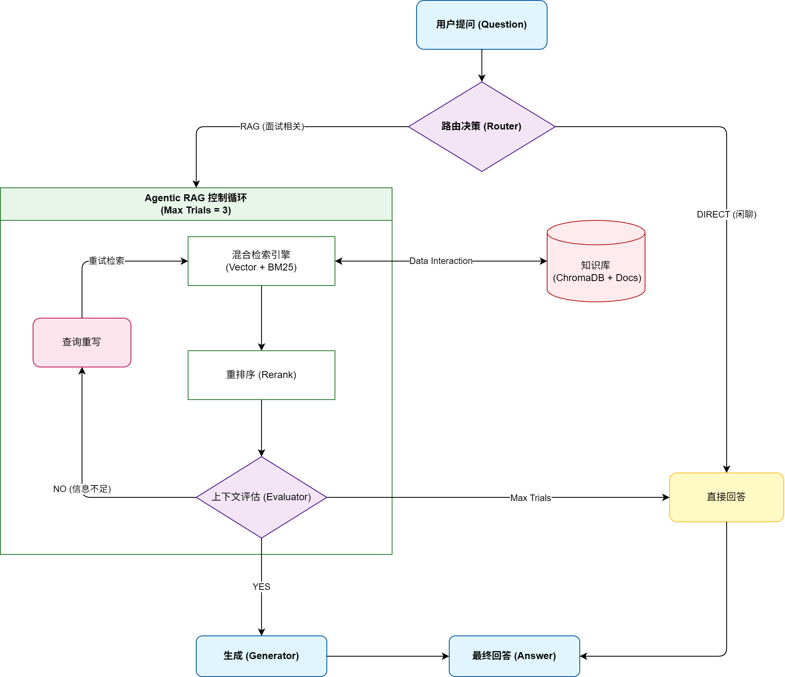

# ✨ CHM的知识宇宙 - 个人技术博客系统

这是一个基于 **Vue3** + **FastAPI** 搭建的全栈个人技术博客系统，集成了基于 **Agentic RAG** 技术的 AI 面试助手。项目不仅用于记录博主在 C++ 及 AI 算法领域的学习心得，更是一个智能化的知识库管理平台。

## Agentic RAG 实现框架

## 🚀 核心功能

* **动态博客管理**：支持 Markdown 文章的后台发布与展示。在后台发布文章时，系统会自动同步生成本地 `.md` 文件，实现知识库的实时更新。
* **AI 面试助手 (RAG)**：集成基于大模型的全局悬浮聊天组件。助手通过向量数据库（ChromaDB）检索本地面试心得文档，提供专业且具有针对性的问答服务。
* **权限校验系统**：采用 **JWT (JSON Web Token)** 实现后台管理页面的登录保护，确保只有管理员可以发布和修改文章。
* **全栈工程化**：
* **前端**：使用 Vue3 (Composition API) + Element Plus 构建，具备响应式布局与平滑的页面过渡动画。
* **后端**：使用 Nginx + FastAPI 提供高性能 API 服务，结合 SQLAlchemy 管理 SQLite 数据库。
* **AI 引擎**：利用 LangChain 框架构建 RAG 工作流，包含文档分块、向量化检索、Rerank 重排序及 LLM 整合。

## 🛠️ 技术栈

### 前端 (Frontend)

* **框架**：Vue 3 (Vite)
* **UI 组件库**：Element Plus
* **路由**：Vue Router (包含全局前置守卫进行权限拦截)
* **网络请求**：Axios

### 后端 (Backend)

* **核心框架**：FastAPI
* **数据库**：SQLite (SQLAlchemy ORM)
* **AI/RAG**：LangChain, OpenAI/DeepSeek API, ChromaDB
* **安全认证**：PyJWT, OAuth2, Https

## 📂 项目结构亮点

* **前后端分离**：前端通过 RESTful API 与后端通信，支持跨域请求配置。
* **自动化知识闭环**：博主每发布一篇技术文章，该内容会立刻成为 AI 助手知识库的一部分，实现了“写博文即训练 AI”的自动化流程。
* **优雅的用户体验**：全局悬浮的 AI 助手窗口，支持即时唤起，为读者提供交互式的学习体验。

## 🌐 部署与访问

* **后端地址**：（1）[个人博客https已暂停访问](https://chen5.asia/) （2）[个人博客http可访问](http://150.158.123.242:8080/)
* **个人链接**：[Github: CHM00](https://github.com/CHM00) | [CSDN 博客](https://blog.csdn.net/weixin_49891405?type=blog)

---

*持续学习，持续输出。*
